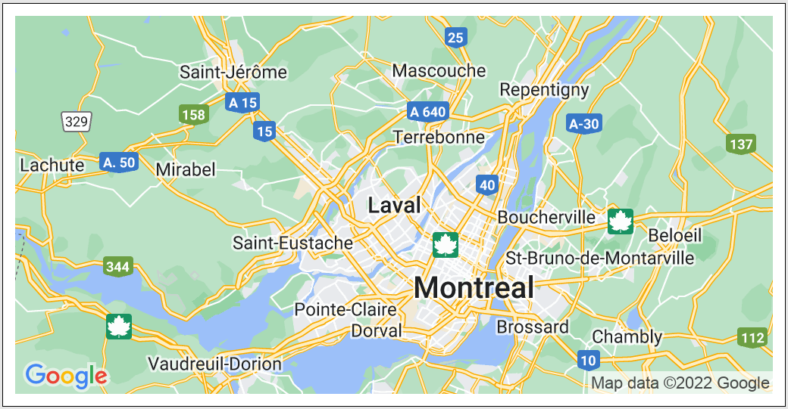
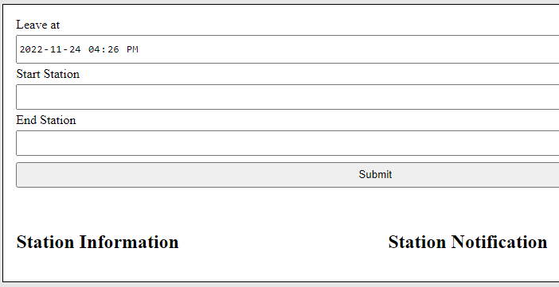

# REM Tracker

This final project was to implement several APIs run on the school servers that returned REM station information. The goal was to make a REM trip tracker using those API responses. I further implemented a google maps api that displayed pins on the station locations to make the trip appear visually.

## Maps API

## User Choice
